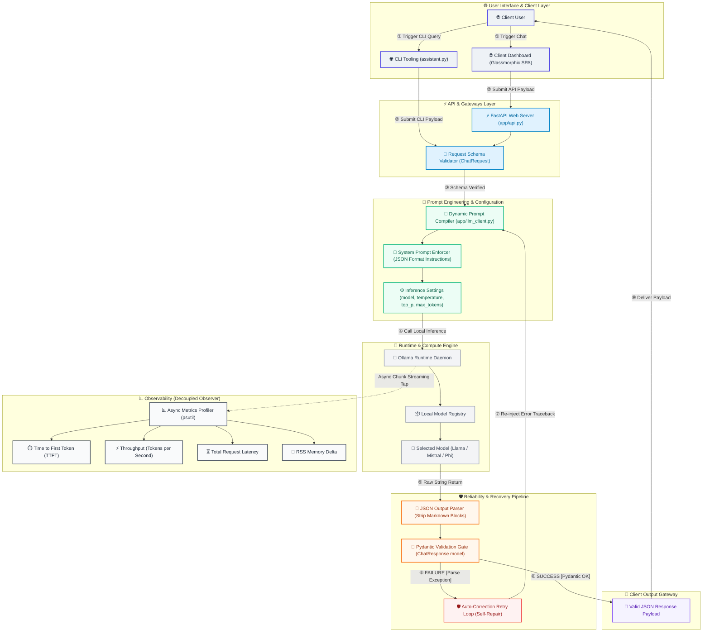
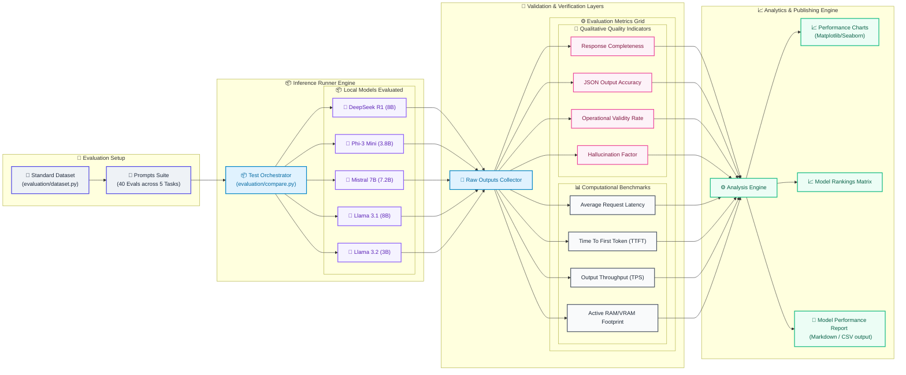

# 🏛️ LocalLLM-Lab: Enterprise Architecture Design Document

This document outlines the architectural blueprints, execution flows, and engineering specifications for **LocalLLM-Lab**, a production-grade playground for local LLM inference, validation, and benchmarking.

Designed under enterprise system architecture patterns (comparable to documentation from Microsoft AI, Anthropic, and NVIDIA), this system is split into two isolated modules:
1. **Runtime Inference Architecture** (The request/response path).
2. **Evaluation & Benchmarking Pipeline** (The offline analytics engine).

---

## 🧭 System Legends & Semantic Design Tokens

### A. Semantic Color Palette
To preserve cognitive clarity, all components across diagrams utilize a standardized semantic coloring system:

| Layer Domain | Semantic Meaning | Recommended Hex Codes (Light/Dark Theme) |
| :--- | :--- | :--- |
| **API & Backend** | HTTP routing, servers, endpoints | `#E0F2FE` (bg) / `#0284C7` (stroke) / `#1E3A8A` (dark fill) |
| **Prompt Engineering** | System prompts, formatting constraints | `#ECFDF5` (bg) / `#10B981` (stroke) / `#064E3B` (dark fill) |
| **Model Operations** | Quantization weights, model files | `#F5F3FF` (bg) / `#8B5CF6` (stroke) / `#4C1D95` (dark fill) |
| **Validation Gate** | JSON parsing, schema checks | `#FFF7ED` (bg) / `#F97316` (stroke) / `#7C2D12` (dark fill) |
| **Retry & Error Recovery**| Dynamic repair, error fallback loops | `#FEF2F2` (bg) / `#EF4444` (stroke) / `#7F1D1D` (dark fill) |
| **Evaluation Layer** | Prompt testing, model scoring | `#FDF2F8` (bg) / `#EC4899` (stroke) / `#831843` (dark fill) |
| **Infrastructure** | Runtime runtimes, OS systems | `#F9FAFB` (bg) / `#9CA3AF` (stroke) / `#1F2937` (dark fill) |
| **Metrics & Analytics** | Process metrics, latency trackers | `#F3F4F6` (bg) / `#4B5563` (stroke) / `#111827` (dark fill) |

### B. Icons Index
* `🌐` **User / Client View:** Front-end dashboard and CLI environments.
* `⚡` **FastAPI:** Routing layer and API schemas.
* `🧠` **Prompt Orchestrator:** Prompt compiling and constraints.
* `📝` **JSON Validation:** Pydantic validators.
* `🛡️` **Retry Logic:** Self-correction loop.
* `🤖` **Ollama Runtime:** Native background process coordinator.
* `📦` **Model Registry:** Model weights and metadata.
* `🧠` **Local Models:** Active inference processes.
* `📊` **Benchmarking:** Stream metrics collector.
* `📈` **Charts:** Output visualization assets.
* `📄` **Reports:** Markdown/CSV data files.

---

## ⚡ Diagram 1: Runtime Inference Architecture

This diagram details the lifecycle of a single user request. It follows a clean top-to-bottom pipeline. The **Benchmarking Engine** acts as an decoupled observer, tapping into the execution stream without blocking the primary request path.

---

## 🔬 Diagram 2: Evaluation & Benchmarking Pipeline

This diagram showcases the offline quality and latency evaluation harness. It explains how models are compared programmatically across standard parameters to rank efficiency and accuracy.

---

## 🎨 High-Resolution SVG & Draw.io Export Guide

To export these diagrams into vector-based SVG formats suitable for presentation slide decks or markdown rendering platforms:

### A. Export Instructions
1. **Interactive Setup:** Copy the Mermaid code and paste it into the [Mermaid Live Editor](https://mermaid.live).
2. **Configuration Settings:** Locate the Configuration panel on the left and set the theme configuration to `default` or `dark` based on your document styling guidelines.
3. **SVG Vector Download:** Click the **Actions** menu at the bottom and download the output as a high-resolution SVG. 
4. **Draw.io Import:** In Draw.io, navigate to `File` -> `Import from` -> `Mermaid...`, paste the code block directly, and apply standard styling settings to auto-generate editable canvas blocks.

### B. High-Resolution Presentation Adjustments
For high-resolution prints, configure the following adjustments in your drawing tool:
* **Padding:** Apply a minimum boundary padding of `30px`.
* **Font Family:** Set system font parameters to `system-ui, -apple-system, sans-serif` for clean readability.
* **Canvas Grid Alignment:** Snap components to a grid configuration to ensure spacing remains consistent across blocks.

---

## 🛠️ Architectural Breakdown & Layer Explanations

### 1. User Interface & API Gateways
* **Client Interface Layer (`🌐 UI/CLI`):** Serves as the user entry point. Handles markdown rendering and formatting configurations before payload dispatch.
* **FastAPI Server (`⚡ API Gateway`):** Acts as the asynchronous API gateway. It utilizes an event loop configuration to process requests without blocking background process workers.
* **Pydantic Validation Guard (`📝 Request Validator`):** Validates API request parameters against Pydantic definitions before submission. This filters invalid requests early and reduces compute overhead on local hardware.

### 2. Prompt & Inference Config Layer
* **Dynamic Prompt Compiler (`🧠 Prompt Compiler`):** Translates user prompts into model instructions by injecting system prompts and structural rules.
* **Inference Settings (`⚙️ Config Layer`):** Exposes parameters (temperature, top_p, max_tokens) directly to the inference runtime, matching prompt requirements with appropriate model parameters.

### 3. Verification & Self-Correction Engine
* **Output JSON Parser (`📝 JSON Guard`):** Extracts valid JSON content from model outputs, stripping out trailing chat commentary or markdown formatting blocks.
* **Pydantic Schema Validator (`📝 Validation Gate`):** Parses raw strings against output schema requirements, ensuring data integrity.
* **Auto-Correction Engine (`🛡️ Retry Loop`):** If validation fails, this module formats a recovery prompt containing the exact parser traceback, enabling the model to correct its own output in real-time.

### 4. Metrics & Evaluation Engines
* **Benchmarking Suite (`📊 Observability`):** An observer that streams response data chunks to measure Time To First Token (TTFT) and token throughput (TPS) without adding overhead to the runtime inference path.
* **Comparison Engine (`🔬 Evaluation Harness`):** Compares model output accuracy against standard datasets, providing rankings and data to guide production deployment decisions.

---

## ⚖️ Engineering Trade-offs & Decisions

### 1. Hard JSON Enforcement vs Generative Freedom
* **Design Decision:** The system forces JSON formatting directly at the inference layer (`format="json"`) and validates output using Pydantic, rather than using unstructured text generation.
* **Trade-off:** Enforcing strict structures significantly improves JSON parsing reliability. However, it can occasionally reduce reasoning complexity in smaller models (e.g., Llama 3.2 3B) under high temperature configurations. The system balances this using the self-correction retry loop.

### 2. Asynchronous Streaming vs Simple REST Blocking
* **Design Decision:** Utilizes asynchronous endpoints (`asyncio`, `AsyncClient`) to handle user requests.
* **Trade-off:** Asynchronous architectures scale effectively on multi-user systems. However, async processing makes tracing errors across the validation pipeline more complex. The architecture resolves this by using clear logging layers.

### 3. Distilled Reasoning Models vs Small Language Models (SLMs)
* **Design Decision:** Providing choices between 3B/3.8B parameters (Phi-3 / Llama 3.2) and 8B distilled models (DeepSeek-R1).
* **Trade-off:** Small models are faster and require less memory (TTFT < 0.2s, <3GB VRAM), making them suitable for standard edge hardware. Distilled models (DeepSeek-R1 8B) provide improved reasoning on complex tasks, but exhibit higher latency (TTFT > 0.4s) and require more compute resources.
