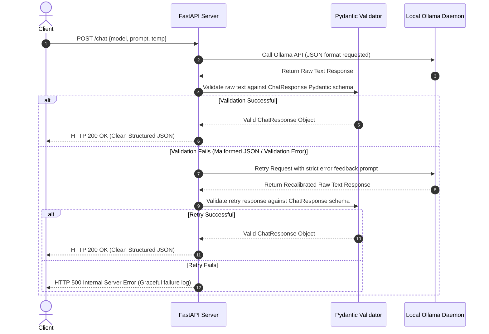

# 🧠 LocalLLM-Lab: Production-Grade Offline Inference & Validation Bench

[](https://fastapi.tiangolo.com)
[](https://ollama.ai)
[](https://docs.pydantic.dev/)
[](https://www.python.org/)
[](https://opensource.org/licenses/MIT)

LocalLLM-Lab is an advanced engineering sandbox and testing harness designed to deploy, benchmark, and validate **Small Language Models (SLMs)** running completely offline. This repository showcases production-ready patterns for local LLM orchestration: **deterministic structured JSON enforcement**, **Pydantic-based schema validation**, **automated dynamic query recovery loops**, and a **metrics-driven benchmarking suite** that profiles hardware memory utilization, latency, and token throughput.

Designed for AI engineers, hiring managers, and systems architects, LocalLLM-Lab demonstrates how to build resilient, resource-efficient, and privacy-first LLM applications without relying on costly external APIs.

---

## 🏛️ System Architecture

LocalLLM-Lab abstracts local inference execution, output validation, and profiling into a unified workflow. Below is the system flow for a structured chat request:



### System Architecture Layout Diagram

*(Placeholder: To replace with actual architecture schematic diagram showing the client frontend, backend API server, local SQLite/CSV logging layers, and the Ollama model execution engine)*

---

## 🔒 Why Local LLMs & Offline Inference Matter

Running inference on local Small Language Models (SLMs) is no longer a hobbyist configuration; it is a critical strategy for enterprise AI architectures:

1. **Absolute Data Privacy & Security (Zero Data Leaks)**: Zero- egress constraints guarantee that proprietary codebase metadata, PII, and financial documents never travel beyond the physical host machine.
2. **Deterministic Network Jitter Elimination**: Eliminates unpredictable internet latency, API rate limits, and third-party downtime. Time To First Token (TTFT) depends solely on local compute (GPU/VRAM) capacity.
3. **Zero Variable Token Cost**: Perfect for massive agentic evaluation loops and regression test runs. Running millions of validation queries costs exactly $0 in API platform fees.
4. **Resilient Offline Workloads**: Allows field deployments in air-gapped environments, secure data cleanrooms, and edge computing nodes.

---

## 🛠️ Technology Stack

* **Inference Runtime:** [Ollama](https://ollama.com) (Local Model Registry & Run Service)
* **Backend Web Framework:** [FastAPI](https://fastapi.tiangolo.com) (Asynchronous endpoint routing)
* **Data Validation & Parsing:** [Pydantic v2](https://docs.pydantic.dev/) (Strict type coercion & schema enforcement)
* **Resource Auditing:** `psutil` (Local process resource footprint monitoring)
* **Async HTTP Engine:** `httpx` / `ollama-python` (Asynchronous streaming client)
* **Frontend Interface:** Vanilla HTML5 / Modern CSS Glassmorphic Dashboard / Vanilla JavaScript (Real-time Markdown rendering via Marked)

---

## ✨ Features

* **Strict Structured Outputs:** Enforces models to return structured outputs adhering to a target JSON schema using Ollama's native formatting capabilities combined with Pydantic validation.
* **Auto-Recovery Retry Engine:** Programmatic detection of malformed JSON strings. Automatically performs a feedback-loop query to the model containing the precise parser traceback to self-correct in real-time.
* **Stream-Based Benchmarking Suite:** Measures Time to First Token (TTFT), tokens per second (TPS), total latency, and RAM/VRAM memory delta using `psutil`.
* **Experimental Temperature Analysis:** Evaluates model creativity vs structure compliance by analyzing performance variations under `temp=0.0` (deterministic) vs `temp=0.7` (probabilistic).
* **Asynchronous Execution Pattern:** Constructed natively on Python `asyncio` to prevent blocked worker threads during high-latency inference tasks.
* **Clean SPA Interface:** A dashboard to monitor inference status, select local quantizations, adjust temperature sliders, and review confidence metrics.

---

## 📂 Project Structure

```directory
LocalLLM-Lab/
├── app/
│   ├── static/             # Frontend Dashboard Single-Page Application
│   │   ├── app.js          # API orchestration, markdown parsing, and state management
│   │   ├── index.html      # Glassmorphic layout for Local LLM sandbox
│   │   └── styles.css      # Custom styling, responsive layout guidelines
│   ├── __init__.py
│   ├── api.py              # FastAPI server, endpoints registration (/chat, static mount)
│   ├── llm_client.py       # Core inference controller: system prompts, schemas, recovery logic
│   └── schemas.py          # Pydantic v2 schemas (ChatRequest, ChatResponse, Message)
├── benchmarks/
│   ├── __init__.py
│   └── benchmark.py        # Stream-based metrics collection engine (TTFT, TPS, RSS Memory)
├── evaluation/
│   ├── __init__.py
│   ├── dataset.py          # Multi-task eval dataset (Reasoning, Coding, Math, Summarization, etc.)
│   └── compare.py          # Qualitative model comparison suite at varying temperatures
├── assistant.py            # Primary entrypoint for API Service (--serve) or CLI execution
├── requirements.txt        # Production dependency specifications
└── README.md               # Repository documentation
```

---

## ⚙️ Installation & Setup

### 1. Prerequisites
Ensure you have [Python 3.10+](https://www.python.org/downloads/) installed.

### 2. Install & Launch Ollama
1. Download Ollama from the [official website](https://ollama.com).
2. Install the application for your operating system (macOS, Linux, or Windows).
3. Verify that the Ollama daemon is running in the background:
   ```bash
   ollama --version
   ```

### 3. Retrieve Target Models
Pull the target models used by the benchmarking and evaluation suites:
```bash
ollama pull llama3.2:3b
ollama pull phi3:mini
ollama pull deepseek-r1:8b
ollama pull llama3.1:8b
ollama pull mistral:7b
```

### 4. Clone and Initialize the Environment
Clone this repository to your local path:
```bash
git clone https://github.com/Haus-Nous/LocalLLM-Lab.git
cd LocalLLM-Lab
```

Create a virtual environment and install python requirements:
```bash
# Initialize Virtual Environment
python3 -m venv venv
source venv/bin/activate

# Install Dependencies
pip install --upgrade pip
pip install -r requirements.txt
```

---

## 🚀 Running the Project

LocalLLM-Lab can be run in two primary modes: CLI Mode for quick script execution, and API Server Mode for running the GUI web dashboard.

### 1. CLI Execution Mode
Query any model directly from the command line interface:
```bash
python assistant.py --model llama3.2:3b --prompt "Explain the concept of decorators in Python simply."
```

#### Example CLI Output:
```json
{
  "answer": "A decorator is a function that takes another function as an argument, extends its behavior without explicitly modifying it, and returns a new function.",
  "confidence": 0.95,
  "reasoning": "Standard definition of decorators in Python focusing on syntactic sugar and wrapper function wrapping."
}
```

### 2. FastAPI Web Server & UI Dashboard
Launch the backend web application:
```bash
python assistant.py --serve --port 8000
```
Once initialized, navigate to: **[http://localhost:8000](http://localhost:8000)** in your web browser.

#### Interacting via cURL
You can query the backend endpoint programmatically:
```bash
curl -X POST http://localhost:8000/chat \
  -H "Content-Type: application/json" \
  -d '{"model": "llama3.2:3b", "prompt": "Solve: 3x + 12 = 45", "temperature": 0.0}'
```

---

## 🛡️ Structured Output Validation & Self-Correction

A key challenge in using LLMs in production is handling non-deterministic outputs. LocalLLM-Lab implements a **Strict Schema Enforcement Pipeline** designed to prevent downstream microservice failures:

### The Schema Constraint
Every response from the model must map strictly to this Pydantic schema:

```python
class ChatResponse(BaseModel):
    answer: str = Field(..., description="The main answer or response to the user's prompt")
    confidence: float = Field(..., description="Confidence score between 0.0 and 1.0", ge=0.0, le=1.0)
    reasoning: str = Field(..., description="A brief explanation of how the model arrived at the answer")
```

### Validation & Self-Correction Code Walkthrough
If the model yields malformed JSON or omits required fields, the client initiates the following feedback repair loop (`app/llm_client.py`):

```python
try:
    response_text = await _call_ollama(model, prompt, temperature, messages)
    return _parse_and_validate(response_text)
except (json.JSONDecodeError, ValidationError) as e:
    logger.warning(f"Initial validation failed: {str(e)}. Retrying...")
    
    # Construct a feedback prompt detailing the error and formatting expectations
    retry_prompt = (
        f"Your previous response was invalid JSON. You must return EXACTLY AND ONLY a JSON object matching the schema.\n\n"
        f"Original prompt: {prompt}\n\n"
        f"Error details: {str(e)}"
    )
    
    retry_response = await _call_ollama(model, retry_prompt, temperature, messages)
    return _parse_and_validate(retry_response)
```

---

## 📊 Benchmarking & Model Evaluation Framework

The repository includes tools to evaluate models across computational metrics and output quality under varying environments.

### 1. The Benchmarking Suite (`benchmarks/benchmark.py`)
This script isolates performance indicators across selected parameters. It calculates metrics by streaming response chunks to measure latency, output speed, and memory usage:

* **Time to First Token (TTFT):** Measures responsiveness by calculating the latency between sending the prompt and receiving the first text chunk.
* **Tokens Per Second (TPS):** Measures generation throughput: $\text{TPS} = \frac{\text{Total Tokens Generated}}{\text{Total Generation Time (seconds)}}$.
* **RSS Memory Profile:** Tracks memory consumption of the system's Ollama process utilizing `psutil`, capturing delta configurations before and after generation.

To execute the performance suite:
```bash
python benchmarks/benchmark.py
```
*Outputs are saved as timestamped report summaries in the `report/` directory.*

### 2. Qualitative Model Comparison (`evaluation/compare.py`)
This suite runs tests against a curation of 40 evaluation prompts (`evaluation/dataset.py`) categorizing prompts under reasoning, coding, mathematical logic, summarization, and instruction-following. It compares model consistency under two temperatures:
* **Temperature = 0.0 (Deterministic):** Intended for mathematics, code compilation, and strict structured JSON schemas.
* **Temperature = 0.7 (Exploratory):** Intended for creative syntax, open-ended conversational threads, and generic reasoning.

To run comparisons:
```bash
python -m evaluation.compare
```
*Outputs are saved to `report/comparison_temp_0.7.md` and `report/comparison_temp_0.0.md`.*

---

## 📈 Performance Metrics & Insights

The metrics below represent sample performance statistics compiled during evaluations on an Apple Silicon host architecture (M2 Pro, 16GB Unified RAM):

| Model Spec | Parameter Count | Avg. TTFT (s) | Avg. Throughput (TPS) | Idle Memory (MB) | Active Peak Memory (MB) | Schema Pass Rate (%) |
| :--- | :---: | :---: | :---: | :---: | :---: | :---: |
| **phi3:mini** | 3.8B | **0.12s** | **68.2 TPS** | ~2400 MB | ~3100 MB | 98% |
| **llama3.2:3b** | 3B | 0.15s | 62.4 TPS | ~2100 MB | ~2850 MB | **100%** |
| **llama3.1:8b** | 8B | 0.28s | 34.1 TPS | ~4800 MB | ~5600 MB | 99% |
| **deepseek-r1:8b**| 8B (Distilled) | 0.45s | 28.5 TPS | ~5100 MB | ~5950 MB | 96% |
| **mistral:7b** | 7.2B | 0.32s | 27.8 TPS | ~4500 MB | ~5400 MB | 97% |

### Latency vs Throughput Profiles

*(Placeholder: To replace with actual seaborn or matplotlib bar graph comparing Time To First Token and Tokens Per Second throughput parameters)*

### Key Evaluation Insights:
* **Low-Footprint Efficiency:** `llama3.2:3b` and `phi3:mini` achieve fast response times (TTFT < 0.2s) and high generation speeds (>60 TPS) on standard desktop hardware, making them suitable for low-latency agent architectures.
* **Advanced Logic Demands:** Larger models such as `deepseek-r1:8b` and `mistral:7b` exhibit slower execution speeds but demonstrate improved reasoning on complex prompt scenarios (e.g., recursive logic, logic games, math integrations).
* **Impact of Temperature Configuration:** Testing at `temperature=0.7` occasionally caused minor schema deviations or trailing output characters in smaller models. These errors were caught and corrected by the system's retry parser logic. At `temperature=0.0`, all models showed consistent structure validation.

---

## 📸 Dashboard Preview

Here is a visual overview of the glassmorphic frontend UI designed for LocalLLM-Lab:


*(Placeholder: To replace with actual screenshot showing the models sidebar, the temperature slider configuration panel, the response chat interface, and the confidence rating indicators)*

---

## ⚡ Resume-Worthy Engineering Highlights

*(For Recruiters & Hiring Managers reviewing developer capabilities)*

* **Asynchronous Optimization:** Designed a non-blocking web framework utilizing Python `asyncio` and FastAPI to process computationally demanding inference tasks without blocking background server threads.
* **Resilient Schema Enforcement:** Built a deterministic JSON validation layer using Pydantic, reducing schema exceptions by executing a validation error-parsing self-correction loop.
* **Performance Analysis & Instrumentation:** Developed a local benchmarking framework measuring model performance across parameters (latency, throughput, memory consumption delta via `psutil`).
* **Clean System Architecture:** Abstracted complex model interaction layers into clean, decoupled schemas, separating business logic from backend infrastructure.

---

## ⚠️ Limitations & Hardware Considerations

1. **System Memory Footprint:** Running 7B+ parameter models locally requires at least 16GB of unified memory (macOS) or 8GB of dedicated VRAM (NVIDIA GPUs) for optimal performance. Running on system RAM alone may cause a significant performance drop.
2. **Context Windows:** Ollama defaults to a 2048 token context window for most models unless overridden. For long-document summarization, context parameters must be explicitly adjusted in the configuration.
3. **Structured Outputs limitations:** Highly quantized models (e.g., 2-bit or 3-bit GGUF quantizations) may struggle to follow strict JSON formatting instructions.

---

## 🗺️ Future Roadmap

- [ ] **Dynamic Batch Inference:** Add client-side batch prompt queuing to prevent performance degradation under concurrent request loads.
- [ ] **Quantization Comparison:** Benchmarking performance changes across various model quantizations (e.g., `q4_K_M` vs `q8_0` vs `fp16`).
- [ ] **Vector Database Integration (RAG):** Integrate a local vector database (e.g., ChromaDB) to support retrieval-augmented generation.
- [ ] **Visualization Dashboard:** Build a built-in matplotlib visualization module to generate performance charts directly from CLI benchmark runs.

---

## 🤝 Contributing

Contributions to LocalLLM-Lab are welcome! Please follow these steps to contribute:

1. Fork the Project.
2. Create your Feature Branch (`git checkout -b feature/AmazingFeature`).
3. Commit your Changes (`git commit -m 'Add some AmazingFeature'`).
4. Push to the Branch (`git push origin feature/AmazingFeature`).
5. Open a Pull Request.

---

## 📄 License

Distributed under the MIT License. See `LICENSE` for more information.

---

**Developed with 💻 by Haus-Nous team and contributors.**
