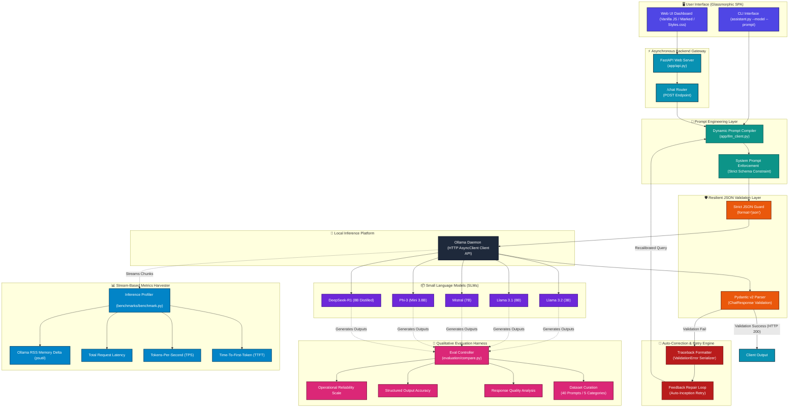

# 🏛️ LocalLLM-Lab: System Architecture Diagram Specification
**Author:** Principal AI Systems Architect  
**Version:** 1.0.0  
**Target:** Production System Design Documentation  

---

## 1. Mermaid Code Specification

This Diagram maps the end-to-end request lifecycle from the UI layer to the localized inference runtimes, showing synchronous processing and parallel metric harvesting engines.

---

## 2. Draw.io / Excalidraw XML & Design Specifications

To manually construct a high-fidelity visual equivalent in Draw.io or Excalidraw, apply the following positioning coordinates, styles, and shapes:

### A. Color Palette Config (HEX Reference)
* **UI Layer:** `#4F46E5` (Indigo-600) — Represents user interaction touchpoints.
* **API Gateway:** `#0891B2` (Cyan-600) — Web endpoints and routing entrypoints.
* **Orchestration & Validation:** `#EA580C` (Orange-600) — Critical schema validation checks.
* **Self-Healing Loop:** `#B91C1C` (Red-700) — Error trapping and retry state recovery.
* **Inference Platform:** `#1E293B` (Slate-800) — Dockerized or native background platforms.
* **Models:** `#6D28D9` (Purple-700) — Compute weights and parameter sets.
* **Benchmarking & Evals:** `#0284C7` (Sky-600) & `#DB2777` (Pink-600) — Metrics gatherers and qualitative analyzers.

### B. Shapes and Grouping Layout Strategy
* **Runtimes & Models:** Use rounded rectangle containers (subgraphs) to isolate compute layers.
* **Validation & Retries:** Draw a standard diamond decision node for **Pydantic Validation Guard** showing a dual branch:
  - Branch A (Success): Leads to HTTP 200 Response Payload.
  - Branch B (Validation Error): Routs back into the **Traceback Formatter** before submitting a corrective prompt to the Model Orchestration Layer.
* **Metrics Harvesters:** Represent as parallel dashboards side-by-side with dotted arrow connection points tapping into the output stream of the local Ollama daemon.

---

## 3. Lucidchart Node & Field Configurations

In Lucidchart, map the layout elements using the **Containers** tool to organize architectural boundaries:

1. **VPC/Local Network Boundary:** Use a double-lined container labeled `Physical Host Machine Boundary (Air-Gapped)` wrapping the API Gateway, Validation layers, Ollama, and Benchmarking Suites to emphasize the zero-egress offline architecture.
2. **Dynamic Processing Stream:**
   - Add a database cylinder icon for the **Local Model Registry**.
   - Connect components using **Dynamic Connectors** with visible directionality (e.g., solid lines for execution flows, dotted blue lines for async performance metrics streaming).

---

## 4. Production Architecture Explanation

### Request Processing Pipeline
1. **User Client Request:** The client triggers a request via the Single Page Application UI or CLI by choosing a local model, temperature config, and submitting a prompt.
2. **FastAPI Route Entry:** The API receives the payload, constructs a standardized `ChatRequest` validation object, and invokes the asynchronous generator.
3. **Structured Prompt Compilation:** The engine appends the strict JSON instruction set system prompt to prevent open-ended conversational configurations.
4. **Local Daemon Delegation:** The Ollama client calls the local daemon service via HTTP requesting JSON validation directly at the inference layer (`format="json"`).
5. **Schema Validation Gate:** The Pydantic validator receives the raw text payload. If parsing fails, the **Self-Healing Module** extracts the exception metadata, formats a new correction instruction, and resubmits it to the model.

### Parallel Data Collection Loops
* **Continuous Profiler Engine:** Captures performance metrics from the Ollama process stream. Measures TTFT by identifying the arrival of the first output frame and calculates throughput (TPS) based on token arrival speed.
* **Qualitative Testing Framework:** Performs offline regression checks across the test dataset to evaluate and log formatting reliability and accuracy.

---

## 5. Export-Ready SVG Layout Recommendations

When exporting this diagram from visual editors for production system design documents:
* **Background Transparency:** Set the export parameter to transparent background to render cleanly on both dark/light themed markdown engines.
* **Fonts:** Use standard monospace fonts (`Consolas`, `Fira Code`) for system nodes, and sans-serif typography (`Inter`, `system-ui`) for descriptions.
* **Line Tensions:** Keep lines orthogonal (90-degree elbows) instead of curved lines to keep the architecture clean and professional.
